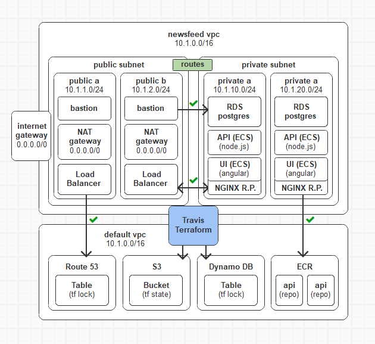

 

# NEWS FEED (e2e-full-stack)
A simple news feed full-stack application project. This is meant to demonstrate the complete end-to-end development workflow from conception all the way to delivery.

## Hosting Environment
  

## Requirements

### Main Feed - Wireframe

### Article - Wireframe

### As an user, I would like to...
- [x] 1.1. Access a news feed listing at most 30 words of the 5 most recently published news, together with its date, number of comments and a link so I can read the entire article.
- [ ] 1.2. Include comments of my own when accessing the news article in full view.
- [x] 1.3. Read comments posted by other readers listed by date in descending order.
- [ ] 1.4. Delete comments of my own authoring only.
- [x] 1.5. Be able to return to the main news feed after read the full article and posting comments.
- [ ] 1.6. Be warned when my comments exceed 1254 characters before posting them.
- [ ] 1.7. Be prompted for confirmation before removing a comment from an article.

### As a developer, I would like to...
- [x] 2.1. Use the least amount of local assets to work on the project.
- [x] 2.2. Be able to build/run/test the code locally without requiring any other tool besides docker+compose.  
- [x] 2.3. Get my changes deployed to the staging environment whenever it is successfuly linted and tested.
- [ ] 2.4. Recreate the database schema from scratch whenever I need to reset the development environment.

### As a maintainer, I would like to...
- [x] 3.1. Manage AWS resources using Terraform on a docker machine (mind item 2.1).
- [x] 3.2. Have a special IAM CI administration user stored in my local aws-vault installation.
- [x] 3.3. Have a branch per environment and review new implementations before approving them into the master branch.
- [x] 3.4. Have all AWS resources tagged with information I will use for healthcheck and forensics analysis.
- [x] 3.5. Have a bastion host EC2 instance for inspecting the resources deployed in the private subnet.

## Development Environment
- [x] 4.1. An Angular frontend boilerplate.
- [x] 4.2. A NestJS backend boilerplate.
- [ ] 4.3. A linting-on-commit local setting. 
- [ ] 4.4. A testing-on-rebuild local setting.
- [x] 4.5. An instance of NGINX serving the frontend.
- [x] 4.6. An instance of PostgreSQL for the backend.
- [x] 4.7. An instance of DynamoDB for terraform locks.
- [x] 4.8. A S3 bucket for storing terraform state.
- [x] 4.9. A load-balancer for blue/green deployments.
- [x] 4.10. A reverse proxy in front of the web applications.
- [x] 4.11. A private subnet where the cluster will reside.
- [x] 4.12. A public subnet where the load balancer/reverse proxy will reside.
- [x] 4.13. A bastion server I will use to get access to resources in the private subnet.
- [x] 4.14. An ECR repository to which docker images will be pushed to.
- [ ] 4.15. A Route 53 Zone configured for a short and friendly custom DNS.
